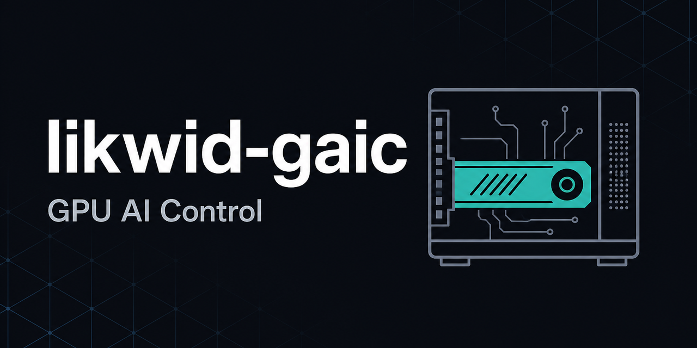

# likwid-gaic

[](https://github.com/likwidmack/likwid-gaic/actions/workflows/ci.yml)
[](LICENSE)
[](package.json)

Local-first control plane for a GPU AI workstation: Compose profiles, model
pins, storage policy, and managed forks.



This repository is the ops hub for [LocalAI](docs/localai-docker-setup.md),
[PrivateGPT](docs/privategpt-docker-setup.md), [Stable Diffusion
WebUI](docs/stable-diffusion-docker-setup.md), and
[ComfyUI](docs/comfyui-docker-setup.md). It orchestrates those applications with
Docker Compose; it does not replace them.

**GAIC** stands for GPU AI Control (aligned with a read-mostly model/asset root
such as `C:\gaic` on the reference workstation).

|              |                                                                                                           |
| ------------ | --------------------------------------------------------------------------------------------------------- |
| Package      | [`likwid-gaic`](package.json) — `private: true` (GitHub-first tooling; not published to the npm registry) |
| Homepage     | [github.com/likwidmack/likwid-gaic#readme](https://github.com/likwidmack/likwid-gaic#readme)              |
| Issues       | [Report a bug or request help](https://github.com/likwidmack/likwid-gaic/issues)                          |
| Contributing | [CONTRIBUTING.md](CONTRIBUTING.md) · [SECURITY.md](SECURITY.md)                                           |

## About

This repository is the **ops hub** for a local GPU AI workstation. It
orchestrates Docker Compose profiles, pinned Hugging Face model metadata,
storage policy, managed fork tracking, and validation. It does not replace
LocalAI, private-gpt, Stable Diffusion WebUI, or ComfyUI themselves.

On GitHub, treat this README like a project landing page: a short summary up
front, links for getting help, and deeper detail in the sections below. If you
maintain a [profile README](https://docs.github.com/en/account-and-profile/concepts/personal-profile#your-profile-readme),
you can pin this repository and link to it from your bio so visitors see what
you work on and how to reach you. See [Personalize your profile](https://docs.github.com/en/account-and-profile/tutorials/personalize-your-profile)
for optional profile fields (bio, links, pinned repositories).

## Who this is for

- Operators running a Windows / WSL2 / NVIDIA workstation with Docker Desktop
- macOS or Linux hosts using CPU inference and RAG (`FORKEDAI_COMPUTE=cpu`)
- Teams that want pinned Hugging Face models, storage policy, and Compose
  profiles instead of ad hoc container setup
- Maintainers tracking managed upstream forks without editing their worktrees

## What you get

- Docker Compose profiles for inference, RAG, media, and ComfyUI
- Pinned Hugging Face model metadata and LocalAI sync helpers
- Storage policy that keeps durable data off disposable disks
- Read-only tracking for five managed upstream forks
- Validation that keeps configuration, privacy rules, and docs consistent

## Get help

| Need                                | Where                                                                                             |
| ----------------------------------- | ------------------------------------------------------------------------------------------------- |
| First run, profiles, HTTPS trust    | [Container operations](docs/container-operations.md)                                              |
| Something broken on the workstation | [Troubleshooting](docs/troubleshooting.md)                                                        |
| Bugs or feature ideas               | [GitHub Issues](https://github.com/likwidmack/likwid-gaic/issues)                                 |
| Pull requests and branch model      | [CONTRIBUTING.md](CONTRIBUTING.md)                                                                |
| Security concerns                   | [SECURITY.md](SECURITY.md) — use GitHub Security Advisories; do not post secrets in public issues |

## Requirements

- Git, Node.js 20+ (`engines.node` in [`package.json`](package.json)), and npm
- Docker Desktop or Docker Engine with Compose
- **NVIDIA path (Windows/WSL or Linux):** current NVIDIA driver / Container Toolkit for GPU profiles
- **CPU path (macOS default, or Linux without NVIDIA):** `FORKEDAI_COMPUTE=cpu` for inference/RAG
- Hugging Face `hf` CLI (WSL on the Windows workstation; host PATH on macOS/Linux)

## Quick start

Clone the repository, then from the root:

**PowerShell:**

```powershell
Copy-Item .env.example .env -ErrorAction SilentlyContinue
npm install
npm test
npm run stack:doctor
npm run stack:config
```

**Bash:**

```bash
cp -n .env.example .env || true
npm install
npm test
npm run stack:doctor
npm run stack:config
```

List available npm scripts with `npm run`. Pass arguments to a script after `--`
(for example `npm run stack -- logs localai`).

For first-run profiles, compute modes, model downloads, and HTTPS trust, see
[Container operations](docs/container-operations.md).

<details id="profiles">
<summary>Compose profiles</summary>

Four Compose profiles are defined in [`config/stack.json`](config/stack.json).
Caddy is the only host-facing service; backends stay on private bridges and are
reached through local HTTPS. Prefer `npm run stack:PROFILE` on a single-GPU host
— those aliases call `switch`, which stops conflicting GPU services first.

| Profile     | Services                         | HTTPS endpoints                                    | Compute     | Start                     |
| ----------- | -------------------------------- | -------------------------------------------------- | ----------- | ------------------------- |
| `inference` | LocalAI                          | `https://localhost:8443`                           | nvidia, cpu | `npm run stack:inference` |
| `rag`       | LocalAI + PrivateGPT             | `https://localhost:8443`, `https://localhost:8444` | nvidia, cpu | `npm run stack:rag`       |
| `media`     | Stable Diffusion WebUI           | `https://localhost:8445`                           | nvidia only | `npm run stack:media`     |
| `comfy`     | ComfyUI backend + frontend proxy | `https://localhost:8446`, `https://localhost:8447` | nvidia only | `npm run stack:comfy`     |

### What each profile does

- **`inference`** — OpenAI-compatible chat API via LocalAI (CUDA 13 or CPU image).
  Needs the pinned chat GGUF (`chat-qwen2.5-3b`), LocalAI YAML from
  `npm run models -- sync-localai`, and (on NVIDIA) the CUDA llama-cpp backend
  from `npm run stack -- backend`.
- **`rag`** — PrivateGPT for document ingestion and retrieval, calling LocalAI for
  LLM and embeddings. Needs the chat model plus `embed-nomic-v1.5`, both YAML
  definitions, and a documents root. PrivateGPT itself is CPU-side; LocalAI still
  holds the GPU (or CPU inference) for model work.
- **`media`** — Automatic1111-style Stable Diffusion WebUI. Needs at least one SD
  checkpoint under the shared model tree (WebUI reads `Stable-diffusion/`). NVIDIA
  only.
- **`comfy`** — ComfyUI workflow API (`8447`) and editor UI (`8446`). Needs a
  starter checkpoint and the Comfy model directory layout under the shared model
  root. NVIDIA only; API nodes stay disabled by default.

Minimum artifacts per profile are listed in
[`config/profile-artifacts.json`](config/profile-artifacts.json). Inspect local
requirements with `npm run models -- recommendations PROFILE`. Before `up` or
`switch`, `stack:doctor` warns when required artifacts are missing; pass
`--require-ready` to fail or `--skip-ready` to silence.

### Single-GPU rule

At most one of `localai`, `stable-diffusion`, or `comfy-backend` may run at a
time. `rag` shares LocalAI with `inference` and is safe together; do not combine
`media` or `comfy` with an active LocalAI without deliberately sharing the GPU.
Details and monitoring: [GPU and CPU resource utilization](docs/resource-utilization.md).

Set `FORKEDAI_COMPUTE=cpu` for inference/RAG without NVIDIA (`media` and `comfy`
still require a GPU). Lifecycle commands and HTTPS CA trust live in
[Container operations](docs/container-operations.md).

</details>

<details id="npm-scripts">
<summary>npm scripts</summary>

Scripts are defined in [`package.json`](package.json). Keywords:
`local-ai`, `docker-compose`, `gpu`, `workstation`, `orchestration`.

### Stack (Compose)

| Script                        | What it does                                                                                      |
| ----------------------------- | ------------------------------------------------------------------------------------------------- |
| `npm run stack`               | Default status (`ps`) for all profiles                                                            |
| `npm run stack:doctor`        | Read-only host checks (Node, Docker, GPU, paths, forks, soft profile readiness, gateway exposure) |
| `npm run stack:config`        | Render Compose for all profiles without starting containers                                       |
| `npm run stack:status`        | Show Compose service status                                                                       |
| `npm run stack:up -- PROFILE` | Start a profile (`up`; refuses GPU conflicts unless `--allow-gpu-share`)                          |
| `npm run stack:down`          | Stop and remove stack services (`down`, never `--volumes`)                                        |
| `npm run stack:build`         | Build all buildable images (optional: `npm run stack:build -- SERVICE`)                           |
| `npm run stack:inference`     | `switch inference` — stop conflicting GPU services, then start LocalAI                            |
| `npm run stack:rag`           | `switch rag` — LocalAI + PrivateGPT                                                               |
| `npm run stack:media`         | `switch media` — Stable Diffusion WebUI                                                           |
| `npm run stack:comfy`         | `switch comfy` — ComfyUI backend + frontend                                                       |

Additional stack subcommands (no dedicated alias):

```powershell
npm run stack -- profiles
npm run stack -- resources
npm run stack -- smoke
npm run stack -- smoke --probe
npm run stack -- smoke --run
npm run stack -- switch media --dry-run
npm run stack -- switch inference --require-ready
npm run stack -- backend
npm run stack -- backend whisper piper
npm run stack -- pull
npm run stack -- logs localai
npm run stack -- stop stable-diffusion
```

`smoke --run` is for NVIDIA workstations only (starts/stops profiles; not for CI).
`switch` and `up` accept `--require-ready` and `--skip-ready` for profile artifact
readiness. Non-loopback `FORKEDAI_BIND_ADDRESS` requires a Caddy basicauth snippet;
see [Network security](docs/network-security.md).

### Models, media, and forks

| Script                                      | What it does                                            |
| ------------------------------------------- | ------------------------------------------------------- |
| `npm run models`                            | List managed model pins                                 |
| `npm run models:bootstrap-optional`         | Download optional pins, sync LocalAI YAML, WebUI links  |
| `npm run models -- recommendations PROFILE` | Print required artifacts for a profile                  |
| `npm run models -- ready PROFILE`           | Exit non-zero if required profile artifacts are missing |
| `npm run models -- inbox`                   | List staged files under models/inbox and plugins/inbox  |
| `npm run models -- promote PATH`            | Move a reviewed file from models/inbox into the catalog |
| `npm run models -- promote-plugin SVC PATH` | Move a reviewed pack from plugins/inbox into plugins    |
| `npm run models -- link-webui [ALIAS]`      | Hard-link checkpoint pins into `Stable-diffusion/`      |
| `npm run models -- plan ALIAS`              | Dry-run download plan for a pin                         |
| `npm run models -- download ALIAS`          | Download a pinned model                                 |
| `npm run models -- verify ALIAS`            | Verify selected files against Hub metadata              |
| `npm run models -- sync-localai`            | Write LocalAI YAML under the shared model root          |
| `npm run models -- search QUERY`            | Hub search via `hf`                                     |
| `npm run models -- inventory`               | Summarize recognized files under the model root         |
| `npm run media -- init`                     | Create configured storage directories (non-destructive) |
| `npm run media -- status`                   | Read-only storage check                                 |
| `npm run media -- latest [KIND]`            | Show recent media files                                 |
| `npm run media -- index`                    | Refresh local media index metadata                      |
| `npm run repos:status`                      | Read-only managed-fork status                           |
| `npm run repos:fetch`                       | Fetch remotes only                                      |
| `npm run repos:update`                      | Fetch + fast-forward-only upstream updates              |
| `npm run inventory`                         | Write `docs/inventory.generated.md` (Git-ignored)       |

### Validation

| Script              | What it does                                           |
| ------------------- | ------------------------------------------------------ |
| `npm test`          | Configuration check plus unit tests                    |
| `npm run check`     | Validate config, Compose, privacy rules, and doc links |
| `npm run test:unit` | Path, policy, and gateway unit tests                   |

Full daily-ops detail: [Container operations](docs/container-operations.md).

</details>

<details>
<summary>Documentation index</summary>

| Area            | Guide                                                                                                                                                                                         |
| --------------- | --------------------------------------------------------------------------------------------------------------------------------------------------------------------------------------------- |
| Index           | [Documentation](docs/README.md)                                                                                                                                                               |
| Profiles        | [Compose profiles](#profiles) · [npm scripts](#npm-scripts)                                                                                                                                   |
| System design   | [Architecture](docs/architecture.md)                                                                                                                                                          |
| Daily operation | [Container operations](docs/container-operations.md)                                                                                                                                          |
| Resources       | [GPU and CPU utilization](docs/resource-utilization.md)                                                                                                                                       |
| Troubleshooting | [Troubleshooting](docs/troubleshooting.md)                                                                                                                                                    |
| Service setup   | [LocalAI](docs/localai-docker-setup.md) · [PrivateGPT](docs/privategpt-docker-setup.md) · [Stable Diffusion](docs/stable-diffusion-docker-setup.md) · [ComfyUI](docs/comfyui-docker-setup.md) |
| Workloads       | [Use cases and models](docs/use-cases-and-models.md)                                                                                                                                          |
| Data            | [Models and managed media](docs/models.md)                                                                                                                                                    |
| Security        | [Network security](docs/network-security.md) · [GitHub access](docs/github-access.md)                                                                                                         |
| Contributing    | [CONTRIBUTING.md](CONTRIBUTING.md) · [SECURITY.md](SECURITY.md)                                                                                                                               |

</details>

## Privacy

Source, non-secret configuration, validation, and documentation belong in Git.
Model weights, generated media, private documents, credentials, databases, and
runtime state do not.

## License

[MIT](LICENSE)
